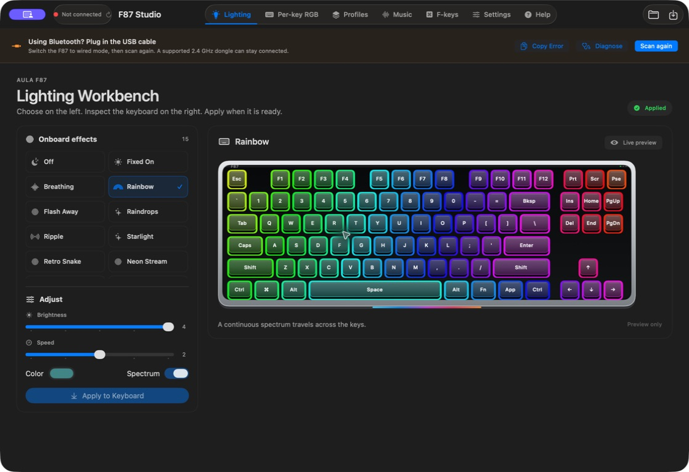
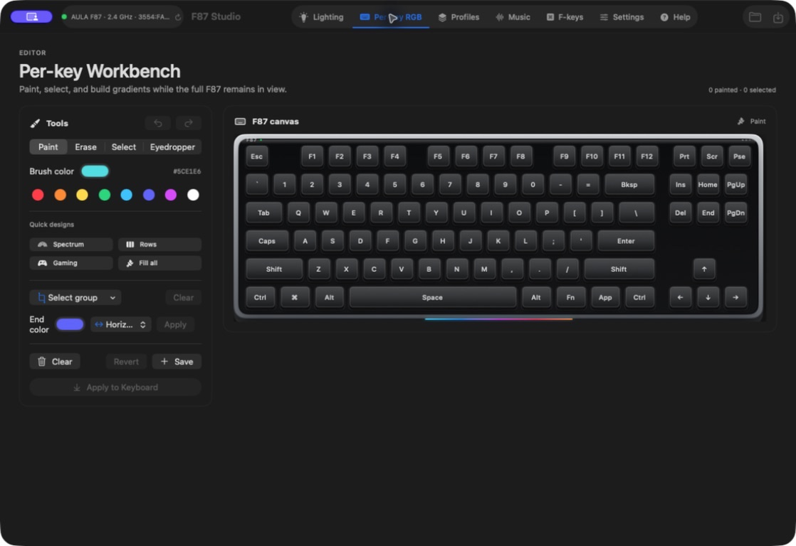
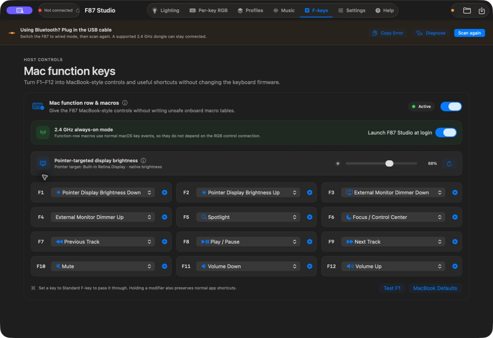
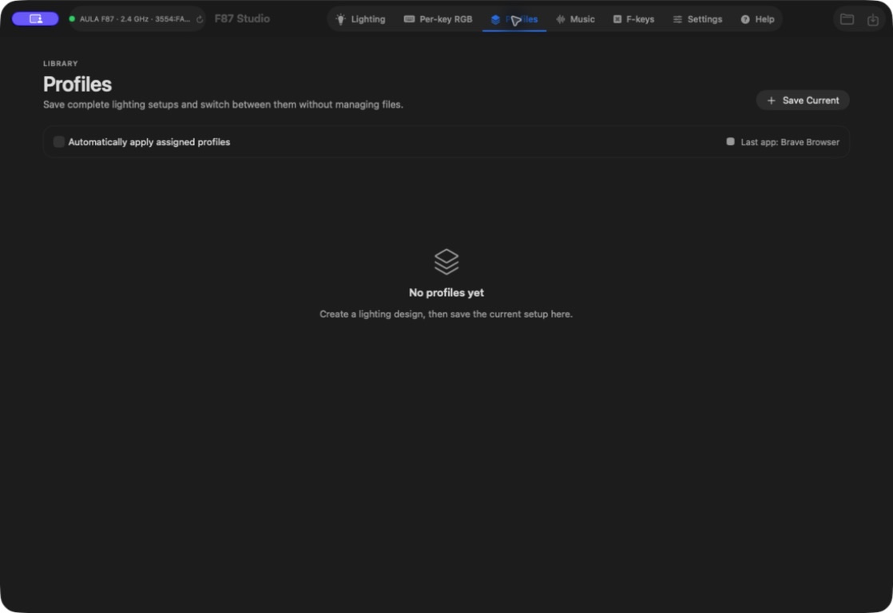
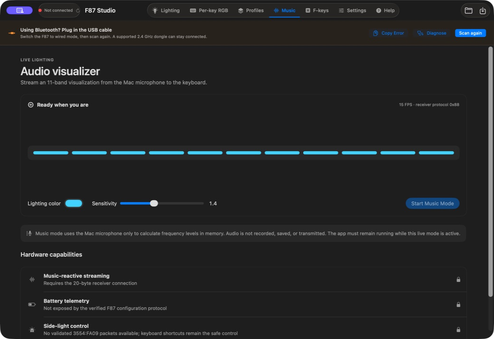

# F87 Studio for macOS

**Configure your AULA F87 or F87 Pro keyboard on a Mac.**

AULA ships its full configuration software for Windows. F87 Studio brings the useful
parts to macOS: onboard RGB effects, per-key colour editing, profiles, music-reactive
lighting, MacBook-style function keys, and clear connection diagnostics.

Lighting settings are written **to the keyboard itself**, so they remain after F87
Studio closes and follow the keyboard to another computer. Mac function-key actions,
automatic profiles, and Music mode are Mac-powered features and need the app running.

---

## Contents

**Getting started**

- [Step 1: Check you have the right setup](#step-1-check-you-have-the-right-setup)
- [Step 2: Download and install](#step-2-download-and-install)
- [Step 3: Give it permission](#step-3-give-it-permission)
- [Step 4: Change your first lighting effect](#step-4-change-your-first-lighting-effect)
- [Step 5: Turn on Mac function keys](#step-5-turn-on-mac-function-keys)
- [Is this safe to install?](#is-this-safe-to-install)
- [Can this break my keyboard?](#can-this-break-my-keyboard)

**When something goes wrong**

- [Troubleshooting](#troubleshooting)
- [The keyboard types, but F87 Studio says Not connected](#the-keyboard-types-but-f87-studio-says-not-connected)
- [The error says not permitted or 0xE00002E2](#the-error-says-not-permitted-or-0xe00002e2)
- [The 2.4 GHz receiver is not detected](#the-24-ghz-receiver-is-not-detected)
- [The F-keys do nothing](#the-f-keys-do-nothing)
- [An effect is selected, but the keyboard did not change](#an-effect-is-selected-but-the-keyboard-did-not-change)

**What it can do**

- [Features](#features)
- [What is not supported yet](#honest-about-what-isnt-supported)
- [Connection support](#connection-support)

**For developers**

- [Building from source](#building-from-source)
- [How the keyboard connection works](#how-the-keyboard-connection-works)
- [Project layout](#project-layout)
- [Publishing a release](#publishing-a-release)

---

# Getting started

## Step 1: Check you have the right setup

You need three things:

| | |
|---|---|
| **A Mac** | macOS 13 Ventura or newer. Apple silicon and Intel are both supported. |
| **An AULA F87-family keyboard** | F87 or F87 Pro using one of the supported control interfaces below. |
| **USB or the known 2.4 GHz receiver** | Wired `258A:010C` and receiver `3554:FA09` are the verified configurations. |

Bluetooth still works for normal typing and Mac function-key actions, but AULA does
not expose the RGB configuration channel over Bluetooth. To change onboard lighting,
connect the USB cable or use the supported 2.4 GHz receiver.

AULA has shipped more than one hardware revision under the F87 name. F87 Studio checks
the USB identity and returned protocol before writing. An unknown device is left alone
rather than treated as close enough.

---

## Step 2: Download and install

1. Open the **[latest release page](https://github.com/kmohammedsu/F87-Studio-macOS/releases/latest)**.
2. Under **Assets**, download **`F87-Studio-macOS.zip`**.
3. Double-click the zip, then move **F87 Studio.app** into **Applications**.
4. Open F87 Studio from Applications.

Current GitHub releases are signed with a Developer ID certificate, notarized by
Apple, and stapled. They should open normally without an unidentified-developer
warning or a Gatekeeper workaround.

---

## Step 3: Give it permission

**The app cannot open the keyboard's configuration channel until Input Monitoring is
allowed.** This is the most common reason a working keyboard appears disconnected.

The AULA control interface identifies as a keyboard-class HID device, so macOS places
it behind **Input Monitoring**. F87 Studio uses that permission only to open AULA's
vendor configuration channel. It does not record typing or collect keystrokes.

1. Open **System Settings → Privacy & Security → Input Monitoring**.
2. Find **F87 Studio** and turn it on.
   - If it is missing, click **+** and choose F87 Studio from Applications.
3. **Quit F87 Studio completely and open it again.**
4. Reconnect the cable or receiver, then click **Scan again**.

> macOS checks this permission when the app launches. Changing the switch while F87
> Studio stays open is not enough; quit it with **⌘Q** and reopen it.

The optional Mac function row needs a second permission:

| Permission | Needed for |
|---|---|
| **Input Monitoring** | Opening the AULA RGB and settings control channel |
| **Accessibility** | Replacing an incoming F1–F12 press with a chosen Mac action |
| **Microphone** | Music mode's live frequency levels; audio is never recorded or uploaded |

---

## Step 4: Change your first lighting effect

1. Open **Lighting**. The connection badge should show **Connected**.
2. Choose an effect from the left side.
3. Adjust brightness, speed, colour, or Spectrum mode.
4. Watch the keyboard preview on the right.
5. Click **Apply to Keyboard**. For Off, the button says **Turn Keyboard Lights Off**.

Selecting an effect edits the preview only. Nothing is sent until you press Apply.
The **Draft / Applied** indicator tells you whether the screen matches the keyboard.

---

## Step 5: Turn on Mac function keys

1. Open **F-keys** and switch the feature on.
2. Click **Allow Access** and enable F87 Studio under **Privacy & Security → Accessibility**.
3. Quit and reopen F87 Studio if macOS asks you to.
4. Pick an action for each key, or choose **MacBook Defaults**.
5. Use the play button beside a row to test it.

The defaults are brightness down/up, Mission Control, Spotlight, Dictation, Focus,
previous track, play/pause, next track, mute, volume down, and volume up.

These mappings work with wired, 2.4 GHz, and Bluetooth connections because they use
normal Mac key events instead of rewriting the keyboard's undocumented onboard key
table. Keep **Launch F87 Studio at login** enabled if you want them available all the
time. Set a key to **Standard F-key** to let its normal F-key event pass through.

---

## Is this safe to install?

Yes. Release builds are **code-signed with an Apple Developer ID certificate** and
**notarized by Apple**. Apple checks the submitted app before issuing a notarization
ticket, and the ticket is stapled to the app in the downloadable archive.

You can verify the installed app yourself. Open Terminal and run:

~~~bash
spctl --assess --type execute --verbose=2 "/Applications/F87 Studio.app"
~~~

The expected result includes:

~~~text
/Applications/F87 Studio.app: accepted
source=Notarized Developer ID
~~~

If Gatekeeper does not accept it, download the archive again from the
[official releases page](https://github.com/kmohammedsu/F87-Studio-macOS/releases)
rather than bypassing the warning.

The app has no account, analytics, cloud sync, keystroke logging, or advertising.
Keyboard configuration, profiles, diagnostics, and Music mode levels stay on the Mac.

---

## Can this break my keyboard?

F87 Studio is deliberately conservative with undocumented hardware.

- **Only known devices and packet formats are accepted.** Unexpected report sizes,
  headers, or acknowledgements stop the operation.
- **The current configuration is read before a normal settings update.** The app
  changes known fields and preserves data it does not understand.
- **Important writes are read back and verified.** A mismatch is reported instead of
  being treated as success.
- **Guessed key-remap tables are never written.** Public tables target different USB
  revisions and are often write-only. Sending one to the receiver could erase existing
  assignments, so F87 Studio uses safe host-side F-key actions instead.
- **Unsupported controls stay disabled.** Timing and factory-reset controls appear
  only on firmware where the corresponding values can be read and checked.

Factory reset restores the verified AULA defaults for lighting, per-key colours,
sleep, and debounce. It does not rewrite normal typing assignments.

---

# Troubleshooting

## The keyboard types, but F87 Studio says Not connected

Typing and configuration use different HID interfaces. macOS can accept normal key
presses while still blocking the vendor configuration interface, so typing proves the
keyboard is present but not that F87 Studio has permission.

1. Move F87 Studio to **Applications**.
2. Open **Privacy & Security → Input Monitoring** and enable it.
3. Quit F87 Studio with **⌘Q** and reopen it.
4. Reconnect the cable or receiver and click **Scan again**.

## The error says not permitted or 0xE00002E2

`0xE00002E2` is macOS refusing access to the HID device. It is a permission problem,
not a failed keyboard.

If Input Monitoring already looks enabled, remove the stale entry and add it again:

1. Open **System Settings → Privacy & Security → Input Monitoring**.
2. Select F87 Studio and click **−**.
3. Click **+** and add `/Applications/F87 Studio.app`.
4. Enable it, quit F87 Studio completely, and reopen it.
5. Reconnect the keyboard and click **Scan again**.

This can happen after replacing an older ad-hoc build with the signed release. The
switch may look enabled while macOS still associates it with the older app identity.

## The 2.4 GHz receiver is not detected

The verified receiver identifies as `3554:FA09`.

- Make sure the keyboard's physical connection switch is in 2.4 GHz mode.
- Reconnect the receiver directly to the Mac or adapter and avoid an unreliable hub.
- Wake the keyboard with a key press, then click **Scan again**.
- If the receiver has a different identifier or still cannot be configured, connect
  the USB cable and switch to wired mode. The app will not guess at an unknown protocol.

Music-reactive streaming specifically needs the verified 20-byte receiver connection.

## Input Monitoring worked before an update

macOS ties privacy access to the app's identity and signature. If an old development
copy is still listed, remove that row from Input Monitoring, add the current copy from
Applications, then quit and reopen the app.

Official releases keep the stable bundle identifier `studio.f87.mac` and a Developer
ID signature so normal release-to-release updates retain their identity.

## The F-keys do nothing

Open **F-keys** and check the status at the top.

- Turn **Enabled** on.
- Allow F87 Studio under **Privacy & Security → Accessibility**.
- Use **Check again** or relaunch the app after changing permission.
- Keep the app running, or enable **Launch F87 Studio at login**.
- Make sure the key is not assigned to **Standard F-key** or **No Action**.

Holding a modifier intentionally preserves normal app shortcuts instead of replacing
the key with a Mac action.

## External monitor brightness is not changing

F1/F2 target whichever display contains the mouse pointer. Move the pointer onto the
monitor you want to adjust, then press the key again.

The MacBook display uses native brightness. HDMI and DisplayPort monitors use universal
software dimming, which changes perceived brightness rather than the monitor's physical
backlight or power consumption.

## An effect is selected, but the keyboard did not change

The effect list controls the preview. Click **Apply to Keyboard** in the left panel.
The status changes from **Draft** to **Applied** after the keyboard confirms the update.

If Apply reports a verification failure, click **Scan again** to reload the current
state and retry once. Do not repeatedly send the same failed write.

## Some Keyboard settings are unavailable

That is intentional. The 520-byte wired firmware and 20-byte receiver firmware store
settings differently. Sleep, debounce, and factory reset are enabled only when the
connected backend exposes a value F87 Studio can safely read and verify.

## Nothing here helped

Open **Settings → Activity**, click **Copy diagnostic report**, and attach it when you
[open an issue](https://github.com/kmohammedsu/F87-Studio-macOS/issues). Include your
Mac model, macOS version, connection type, and exact F87/F87 Pro variant if known.

The report contains connection and protocol activity. It does not contain typed text.

---

# What it can do

## Features

### Onboard RGB effects

Choose from 15 firmware-supported effects, tune brightness and speed, select a solid
colour or full spectrum, and preview the result before applying it. Because the final
setting is stored on the keyboard, the lighting keeps working after the app closes.

*(Shown in the screenshot at the top of this page.)*

### Per-key RGB Workbench

Paint or erase individual keys, drag across the keyboard, select key groups, sample an
existing colour, build horizontal or vertical gradients, and use Spectrum, Rows, or
Gaming quick designs. Undo and redo are available before anything is applied.

### Mac function keys

Assign any F1–F12 key to a Mac action: display brightness, Mission Control, Spotlight,
Dictation, Focus, Show Desktop, App Windows, Control Centre, Notification Centre,
Emoji & Symbols, Quick Note, media, volume, Launchpad, screenshots, Lock Screen,
display sleep, and more.

Brightness follows the pointer. F1/F2 adjust the built-in display when the pointer is
on the MacBook and the external monitor when the pointer is on that display.

### Profiles and automatic app switching

Save an effect and per-key layout as a named profile, duplicate or rename it, export it
as `.f87profile`, and switch from the app or menu bar. Assign a profile to an app and
F87 Studio applies it when that app comes to the front.

Profiles live locally in F87 Studio's Application Support folder. The selected lighting
configuration is sent to the keyboard when a profile is applied.

### Music mode

Turn nearby sound into an 11-band keyboard light show streamed at 15 FPS. Choose the
lighting colour and sensitivity while the app visualizes the live frequency levels.

Music mode uses the Mac microphone only to calculate frequency levels in memory. Audio
is not recorded, saved, or transmitted. This live mode needs F87 Studio to remain open
and currently requires the verified `3554:FA09` receiver protocol.

### Connection health and guided diagnosis

Settings shows whether the app is in Applications, whether Input Monitoring and
Accessibility are active, whether the control channel opened, and whether the protocol
was verified. Errors can be copied, and common failures open into guided recovery steps.

The app automatically checks for a returning keyboard every seven seconds after sleep,
a receiver interruption, or a cable reconnect.

### Private by design

- No account, analytics, ads, or cloud service
- No keystroke or typed-text collection
- Profiles and diagnostic history remain local
- Microphone samples are converted to frequency levels in memory and discarded

## Honest about what isn't supported

The app exposes only behavior verified on the connected firmware.

- **Bluetooth RGB configuration:** unavailable because AULA does not expose the vendor
  control channel over Bluetooth.
- **Battery telemetry:** not exposed by the verified F87 configuration protocol.
- **Side-light control:** no validated `3554:FA09` packets are available yet.
- **Arbitrary onboard remapping and macros:** deliberately disabled; published tables
  target other device IDs and cannot be read back safely on the known receiver.
- **Some wired timing controls:** hidden when the 520-byte backend cannot read and
  verify their offsets.

Mac function-key actions are the safe alternative for the F-row. They work host-side
over any connection that sends normal F-key events and do not overwrite onboard data.

## Connection support

| Connection | Typing | Onboard RGB | Per-key RGB | Mac F-keys | Music mode |
|---|:---:|:---:|:---:|:---:|:---:|
| **USB wired** `258A:010C` | Yes | Yes | Yes | Yes | No |
| **2.4 GHz receiver** `3554:FA09` | Yes | Yes | Yes | Yes | Yes |
| **Bluetooth** | Yes | No | No | Yes | No |

---

# For developers

## Building from source

Requires Xcode 15 or later:

~~~bash
swift test
./scripts/build_app.sh
open "outputs/F87 Studio.app"
~~~

The build script creates a universal Apple-silicon and Intel app at
`outputs/F87 Studio.app` and a shareable `outputs/F87-Studio-macOS.zip` archive.
Local builds are ad-hoc signed with the stable designated requirement
`identifier "studio.f87.mac"`, which prevents every rebuild from appearing as a new
Input Monitoring identity.

## How the keyboard connection works

F87 Studio probes two verified interfaces:

| Device | Transport | Use |
|---|---|---|
| Wired `258A:010C` | 520-byte HID feature report | Current configuration, onboard effects, per-key colour |
| Receiver `3554:FA09` | 20-byte control packets | Effects, per-key colour, timing controls, reset, Music streaming |

Before a normal update, the current state is loaded and validated. Known values are
changed, unknown data is preserved, and important writes are read back. A wrong report
size, header, acknowledgement, or verification result stops the operation.

F87 Studio uses HIDAPI 0.15.0 under its BSD licence. The protocol behavior was
independently implemented from public reverse-engineering work by the AULA open-source
community.

## Project layout

~~~text
Sources/F87Studio/
  AppModel.swift               App state, actions, reconnect and diagnostics
  HIDTransport.swift           Discovery, open, read, write and verification
  F87Protocol.swift            20-byte receiver packets
  FeatureProtocol.swift        520-byte wired configuration
  EffectPreview.swift          Animated on-screen keyboard effects
  FunctionRowController.swift  Mac F-key listener and display targeting
  ProfileStore.swift           Local profiles and app assignments
  MusicVisualizer.swift        In-memory microphone frequency analysis
  Views.swift                  SwiftUI interface
Sources/CHID/                   Bundled HIDAPI bridge
Tests/F87StudioTests/           Protocol and behavior tests
Resources/                     App metadata, icon and entitlements
scripts/                       Universal build and notarized release tools
~~~

## Publishing a release

Tagged releases are built by `.github/workflows/release.yml`, signed with the
maintainer's Developer ID Application identity, submitted to Apple's notary service,
stapled, verified by Gatekeeper, and attached to the matching GitHub release.

The workflow requires these repository secrets:

| Secret | Value |
|---|---|
| `DEVELOPER_ID_APPLICATION_P12_BASE64` | Base64-encoded Developer ID certificate and private key exported as `.p12` |
| `DEVELOPER_ID_APPLICATION_P12_PASSWORD` | Password used when exporting the `.p12` |
| `APP_STORE_CONNECT_API_KEY_BASE64` | Base64-encoded App Store Connect API private key |
| `APP_STORE_CONNECT_API_KEY_ID` | App Store Connect API key ID |
| `APP_STORE_CONNECT_ISSUER_ID` | App Store Connect issuer ID |

For a one-off local notarized build, store an API credential with `notarytool`, set
`F87_SIGN_IDENTITY` and `F87_NOTARY_PROFILE`, then run:

~~~bash
./scripts/release_notarized.sh
~~~

---

## Contributing

Issues and pull requests are welcome, particularly from owners of an F87 hardware or
receiver revision that is not currently recognised. Include a copied diagnostic report
when reporting connection problems, but never post certificates, signing keys, or other
credentials.

## Third-party acknowledgements

- HIDAPI — BSD-3-Clause (`THIRD_PARTY_NOTICES.md`)
- Protocol references: `marcoslor/Aula-F87-Controller`, `free-soldier28/Aula-Manager`,
  `vndarkblue/aula-keybind`, and `veysiemrah/aula-rgb-controller`

F87 Studio is an independent community project and is not affiliated with, endorsed
by, or supported by AULA.
