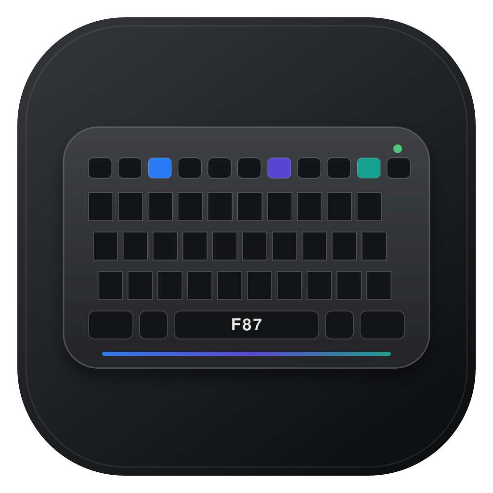

<p align="center">
  
</p>

<h1 align="center">F87 Studio for macOS</h1>

<p align="center">
  A native controller for AULA F87 and F87 Pro keyboards—built for people who use the keyboard on a Mac.
</p>

<p align="center">
  <a href="https://github.com/kmohammedsu/F87-Studio-macOS/releases/latest"></a>
  
  
</p>

<p align="center">
  <a href="https://github.com/kmohammedsu/F87-Studio-macOS/releases/latest"><strong>Download the latest release</strong></a>
  ·
  <a href="#compatibility-and-safety">Check compatibility</a>
  ·
  <a href="#build-from-source">Build from source</a>
</p>

<p align="center">
  
</p>

F87 Studio brings the useful parts of AULA's Windows-only utility to macOS without copying its interface. It is a focused Mac app with live previews, safe device writes, clear permission diagnostics, and no analytics.

## Inside F87 Studio

| Per-key RGB Workbench | Mac function keys |
|---|---|
| Paint, select, build gradients, and preview all 87 keys before applying. | Give F1–F12 MacBook-style actions that keep working over the 2.4 GHz receiver. |
|  |  |

## Highlights

### Lighting that is easy to understand

- Firmware-supported effects, brightness, speed, solid colors, and spectrum modes
- A hardware-style animated F87 preview before changes are applied
- Per-key painting with drag gestures, Undo/Redo, selection groups, eyedropper, gradients, and quick designs
- An always-visible Apply action and clear draft/applied state

### Mac controls on the F-row

- A dedicated F1–F12 workspace with MacBook-style defaults
- Brightness, Mission Control, Spotlight, media, volume, Dictation, Focus, and more
- Pointer-aware brightness: F1/F2 target the MacBook or external display under the mouse
- Host-side mappings that also work while the keyboard uses its 2.4 GHz receiver

### Profiles and live modes

- Reusable `.f87profile` files, a persistent profile library, and menu-bar switching
- Automatic per-application profiles
- Microphone-powered 11-band Music mode on the verified receiver protocol
- Automatic reconnect after sleep or receiver interruption

### Safe and private

- Configuration, profiles, and audio levels stay on the Mac
- No analytics, account, cloud service, keystroke logging, or typed-text collection
- Read-before-write validation and post-write verification
- One-click diagnostic copying with specific recovery guidance

## Download and install

1. Download `F87-Studio-macOS.zip` from the [latest release](https://github.com/kmohammedsu/F87-Studio-macOS/releases/latest), unzip it, and move **F87 Studio** to Applications.
2. This independent community build is ad-hoc signed and is not Apple-notarized. On first launch, Control-click the app, choose **Open**, then confirm **Open**. You do not need to disable Gatekeeper.
3. Connect by USB or the known 2.4 GHz receiver (`3554:FA09`). Bluetooth can type normally, but it does not expose the configuration channel used by the app.
4. Allow F87 Studio under **System Settings → Privacy & Security → Input Monitoring**. macOS asks for this because AULA exposes configuration through a keyboard-class HID interface; F87 Studio does not record typing.
5. For Mac function-key mappings, also allow **Accessibility**. The dedicated **F-keys** screen shows the listener's current state.
6. After changing a permission, quit and reopen F87 Studio, reconnect the cable or receiver, and choose **Scan again**.

## Compatibility and safety

The known protocols cover AULA F87-family devices with the USB identifiers above. AULA has shipped multiple revisions. F87 Studio probes both the 520-byte feature-report protocol used by the detected wired `258A:010C` revision and the 20-byte control protocol used by other known revisions. It reads the complete current configuration before each update, modifies only known bytes, and verifies important changes after saving. If the device does not return the expected format, the app refuses to write.

Sleep, debounce, and factory-reset offsets have not been decoded safely for the 520-byte wired firmware, so those controls are disabled when that backend is detected. Lighting and per-key RGB remain available.

F87 Studio intentionally does not write the keyboard's undocumented macro/key-remap tables. Instead, its optional Mac function row intercepts F1–F12 in macOS and performs the selected action while the app is running. This works independently of the RGB control connection and never overwrites onboard assignments. The documented firmware tables target different USB revisions, cannot be read back from many F87 firmwares, and have not been validated on the `3554:FA09` receiver. Writing a guessed table could erase the keyboard's existing assignments.

## Build from source

Requires Xcode 15 or later:

```sh
swift test
./scripts/build_app.sh
```

The build script creates `outputs/F87 Studio.app` and a shareable ZIP archive.
The packaged app is universal and supports both Apple-silicon and Intel Macs running macOS 13 or later.
Local release builds embed a stable designated requirement for `studio.f87.mac`, so replacing the app with a later build does not create a new Input Monitoring identity.

Tagged releases are built by `.github/workflows/release.yml`, signed with the maintainer's Developer ID Application identity, submitted to Apple's notary service, stapled, verified with Gatekeeper, and attached to the matching GitHub release. The workflow requires these repository secrets:

| Secret | Value |
|---|---|
| `DEVELOPER_ID_APPLICATION_P12_BASE64` | Base64-encoded Developer ID certificate and private key exported as `.p12` |
| `DEVELOPER_ID_APPLICATION_P12_PASSWORD` | Password used when exporting that `.p12` |
| `APP_STORE_CONNECT_API_KEY_BASE64` | Base64-encoded App Store Connect API private key |
| `APP_STORE_CONNECT_API_KEY_ID` | App Store Connect API key ID |
| `APP_STORE_CONNECT_ISSUER_ID` | App Store Connect issuer ID |

For a one-off local notarized build, store an API credential with `xcrun notarytool store-credentials`, set `F87_SIGN_IDENTITY` and `F87_NOTARY_PROFILE`, then run `./scripts/release_notarized.sh`.

The app uses HIDAPI 0.15.0 under its BSD license. Protocol behavior was independently implemented from public reverse-engineering documentation by the AULA open-source community.

## Third-party acknowledgements

- HIDAPI — BSD-3-Clause (`THIRD_PARTY_NOTICES.md`)
- Protocol references: `marcoslor/Aula-F87-Controller`, `free-soldier28/Aula-Manager`, `vndarkblue/aula-keybind`, and `veysiemrah/aula-rgb-controller`

This project is independent and is not affiliated with AULA.
